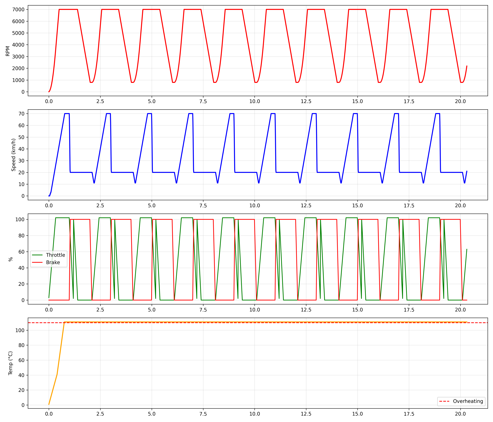

# 🚗 CAN Bus ECU Simulator




> **Professional-grade automotive ECU simulator implementing ISO 11898 CAN protocol with multi-frame arbitration, realistic physics, and diagnostic system.**

## 🎯 Features

- ✅ **Real CAN Bus Implementation**: Message arbitration, priority handling, broadcast
- ✅ **3 CAN Frames**: Powertrain (0x100), Dynamics (0x200), Sensors (0x300)
- ✅ **Realistic Physics**: Engine, throttle, brake, temperature simulation
- ✅ **Diagnostic System**: Error codes (DTC-like), multi-sensor monitoring
- ✅ **Telemetry Export**: CSV logging for post-analysis
- ✅ **Python Visualization**: Automated plotting and analysis

## 🏗️ Architecture

```
    ┌─────────────────────────────────────────────┐
    │            CAN BUS SIMULATOR                │
    └─────────────────────────────────────────────┘
    ECU_TX (Transmitter)
    │
    ├─→ encode_powertrain_frame()  → CAN ID 0x100
    ├─→ encode_dynamics_frame()    → CAN ID 0x200
    └─→ encode_sensors_frame()     → CAN ID 0x300
    │
    ↓
    ┌────────────────────────┐
    │      CAN BUS           │
    │  • send()              │
    │  • arbitrate() ← 🔥    │
    │  • deliver()           │
    └────────────────────────┘
    │
    ↓
    ECU_RX (Receiver)
    │
    ├─→ decode_powertrain_frame()
    ├─→ decode_dynamics_frame()
    └─→ decode_sensors_frame() 
```

## 🚀 Quick Start
### Build
```bash
make
```
### Run
```bash
make run
```
### Analyze
```bash
jupyter notebook analyze_telemetry.ipynb
```

## 📊 CAN Frame Structure

### Frame 1: Powertrain (ID 0x100, DLC 4)
| Byte | Data | Format | Range |
|------|------|--------|-------|
| 0-1  | RPM  | uint16_t (Big-Endian) | 0-8000 |
| 2    | Gear | uint8_t | 0-6 |
| 3    | Flags | Bit 1: Engine On<br>Bit 0: Brake | 0x00-0x03 |

### Frame 2: Dynamics (ID 0x200, DLC 4)
| Byte | Data | Format | Range |
|------|------|--------|-------|
| 0 | Speed | uint8_t | 0-250 km/h |
| 1 | Brake Pressure | uint8_t | 0-100% |
| 2 | Throttle | uint8_t | 0-100% |

### Frame 3: Sensors (ID 0x300, DLC 5)
| Byte | Data | Format | Range |
|------|------|--------|-------|
| 0 | Engine Temp | uint8_t | 0-255°C |
| 1 | Oil Pressure | uint8_t | 0-100 bar |
| 2 | Battery Voltage | uint8_t | 0-255 (×0.1V) |
| 3 | Error Code | uint8_t | DTC codes |
| 4 | Reserved | - | - |


## 📈 Sample Output
```
=== ACTUAL STATE ==
RPM: 4523
SPEED: 145
THROTTLE: 78
BRAKE: 0
GEAR: 4
ENGINE TEMP: 92
OIL PRESSURE: 65
BATTERY_VOLTAGE: 140
ERROR CODE: 0
===================
```

## 🎯 Technical Highlights

**For Automotive Engineers:**
- ISO 11898 compliant message structure
- Multi-priority arbitration system
- Realistic sensor simulation with physics
- DTC-like error code system

**For Software Engineers:**
- Clean architecture (CAN protocol ↔ ECU logic separation)
- Modular design (easy to add new frames)
- Production-quality code (error handling, documentation)
- Multi-language stack (C + Python)

## 📚 Documentation

- [CAN.md](docs/CAN.md) - Complete CAN protocol explanation
- [analyze_telemetry.ipynb](analyze_telemetry.ipynb) - Data analysis notebook
## 🛠️ Technologies

- **C99**: Core simulation
- **Python 3**: Data analysis
- **Jupyter**: Visualization
- **Make**: Build system

## 👤 Author

**Pedro Henrique Bonifácio da Rosa**  
Computer Engineering Student @ UNISINOS  
Focused on: Automotive Embedded Systems | CAN Protocol | ECU Development

📧 pedrorosa.rb@gmail.com  
💼 [LinkedIn](https://www.linkedin.com/in/pedro-bonifácio-9869a9263/)  

## 📄 License

MIT License - Feel free to use for learning and research!

---

⭐ **If this project helped you understand CAN Bus, give it a star!**

*Built with precision for the automotive software community* 🚗💨